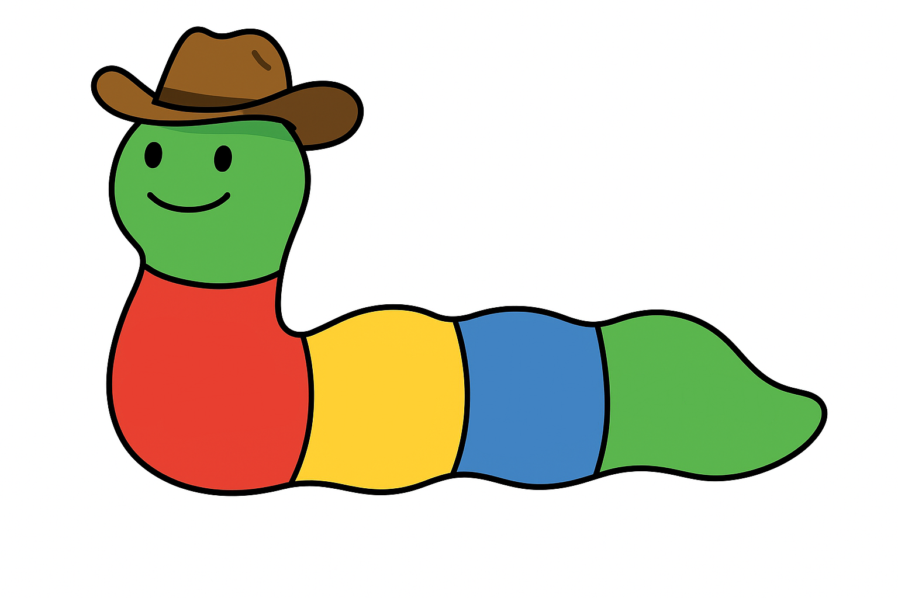

# DevRel WORM Model

## 🧠 What This Is
A visual model for understanding and communicating the internal complexity and cross-functional nature of Developer Relations (DevRel). Built to help DevRel teams align with stakeholders, plan strategically, and demonstrate impact more clearly.

This repository contains:

- The [presentation](https://docs.google.com/presentation/d/1t3M_Qy__lAfB3vsM5rnt0dKi1Z4W-kHPBpjSgqdc53Q/edit?usp=sharing) from my talk at DevRelCon 2025
- Visual examples of each variation the model
- Editable files so you can adapt the model for your own organization

## 🚀 How to Use It

1. **Browse the `/model` folder** for images and source files
2. **Download** the .drawio file for the template you would like to edit
3. **Open** the downloaded file in [draw.io](https://draw.io) or diagrams.net to adapt the model

## 📂 Repo Structure

- `model/` – Draw.io + PNGs of each model variation  
- `presentation/` – Slide deck presented at DevRelCon 2025
- `images/` - Repository images
- `LICENSE` – CC BY-NC 4.0 License  
- `README.md` – You’re here

## 🗣 Feedback Welcome

If you use this model, or even just sit with it for a bit, I'd love your feedback.
What made sense? What didn't? What did/would you add or change? 
I truly believe this kind of work gets better when it’s shared and tested in the real world. This isn’t a final answer—it’s a living tool.

- Open an [issue](https://github.com/knmeiss/devrel-worm-model/issues)
- Tell me your thoughts directly via [email](mailto:knmeiss@gmail.com) (knmeiss [at] gmail [dot] com)
- Suggest improvements via pull request

## License

This project is licensed under the [Creative Commons Attribution-NonCommercial 4.0 International (CC BY-NC 4.0)](https://creativecommons.org/licenses/by-nc/4.0/) license.

Feel free to copy, adapt, and share these materials for **non-commercial use**, with appropriate credit. Commercial use is not permitted without permission.
